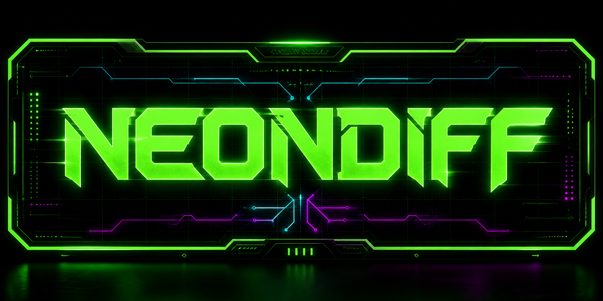

# NeonDiff

**NeonDiff is a local-first AI PR reviewer for teams and agents that want the
review loop without handing every diff to a hosted review SaaS.**



[](docs/precision-badge.md)

Use it when you want a GitHub App to review pull requests from a local worker,
with your GitHub installation, your provider keys, your repo policy, and
public-safe evidence for every live posting decision.

The current npm CLI (v1.0.x) requires API-backed activation for every repository
(public, private, internal, and unknown); unknown visibility fails closed, and
provider verification is required for all tiers.

Coming with the native app: public open-source repositories will be free with no
NeonDiff Activation Key, while private, internal, and commercial repositories
will require an active entitlement. This managed public-free/private-paid model
ships with the native NeonDiff app and the managed GitHub App broker (#614) and
is not enforced by the current CLI. NeonDiff
support licenses cost $1/month or $10/year for individuals,
or $100/year for organizations. Individual plans include a 7-day trial,
organization plans include a 30-day trial, and legacy lifetime licenses remain
honored but are no longer sold. NeonDiff is source-available commercial
software, not open-source software.

[Website](https://www.neondiff.com) · [Setup](docs/SETUP.md) ·
[GitHub App Install](docs/github-app-setup.md) · [Contributing](CONTRIBUTING.md) ·
[Agent Instructions](AGENTS.md) · [Security](SECURITY.md) ·
[Code of Conduct](CODE_OF_CONDUCT.md) · [License](LICENSE.md) ·
[License Boundary](docs/license-boundary.md) · [Pricing](docs/pricing.md) ·
[Providers](docs/providers.md) ·
[systemd](docs/systemd.md) · [Docker](docs/docker.md) · [CI Runner](docs/ci-runner.md) ·
[Known Limitations](docs/known-limitations-and-provider-status.md) ·
[Precision Badge](docs/precision-badge.md) ·
[Roadmap](https://github.com/electricsheephq/evaos-code-review-bot-neondiff/issues/103) ·
[Repository](https://github.com/electricsheephq/evaos-code-review-bot-neondiff)

## Why It Matters

AI-built software has made PR volume and review fatigue worse. NeonDiff is built
for the opposite posture: run locally, read only the pull request it is asked to
review, post only current-head comments, and keep provider/model cost under the
user's control.

The current implementation grew from the internal evaOS review bot. This repo is
now the NeonDiff implementation surface; older internal naming is legacy
operator history, not the public product name.

## What It Does

NeonDiff currently provides:

- a GitHub App based pull-request reviewer
- current-head duplicate suppression for `{repo, pr, head_sha}`
- dry-run review output before live posting
- inline finding placement only on current RIGHT-side diff lines
- secret-looking finding suppression
- stale-head checks before command-triggered review, planning, and posting
- local evidence logs with secret redaction
- repo profile and policy configuration
- JSON-first operator commands for status, queue, dashboard, cooldowns, and why
- offline eval packets for comparing seeded defects, CI, human review, and bot findings

It intentionally does not approve PRs, merge branches, push repairs, expand
GitHub permissions by profile alone, or claim calibrated review accuracy before
evals prove it.

## Install

Requirements:

- Node.js 26 or newer
- npm
- a GitHub App installed on the repos you want to review
- a model/provider path configured locally, such as GLM/Z.ai, Ollama, or a
  future OpenAI-compatible provider slot

> **v1.0.4 verification notice:** v1.0.4 is the first package intended to enforce
> mandatory API-backed activation. Verify `npm view neondiff version` and the
> matching non-prerelease GitHub Release before relying on it; v1.0.3 and
> earlier do not enforce this boundary.

Recommended package install after v1.0.4 is published and verified:

```bash
npm install -g neondiff
```

Installer script path:

```bash
curl -fsSL https://www.neondiff.com/install | sh
```

The installer script checks for Node.js 26 or newer and installs the same npm
package. To preview without changing your machine:

```bash
curl -fsSL https://www.neondiff.com/install | sh -s -- --dry-run
```

Source checkout fallback:

```bash
git clone https://github.com/electricsheephq/evaos-code-review-bot-neondiff.git neondiff
cd neondiff
npm install
npm run build
```

If you intentionally use the source checkout without the global package,
substitute `./dist/src/cli.js` anywhere this guide calls `neondiff`.

## Set Up

Follow [docs/SETUP.md](docs/SETUP.md) for the CLI-first setup path (the
first-run path on non-Mac platforms and the operator/advanced path on Mac). The
short version is:

```bash
neondiff init --config config.local.json
neondiff dashboard --config config.local.json
export NEONDIFF_GITHUB_APP_ID="<github-app-id>"
export NEONDIFF_GITHUB_APP_CLIENT_ID="<github-app-client-id>"
export NEONDIFF_GITHUB_APP_PRIVATE_KEY_PATH="/absolute/path/to/neondiff.private-key.pem"
neondiff doctor github --config config.local.json --json
neondiff providers list --config config.local.json --json
neondiff providers doctor --config config.local.json --json
neondiff doctor --config config.local.json --json
```

For the Mac customer journey, the native macOS app (`apps/neondiff-desktop`) is
the human first-run surface. The local HTML dashboard is an operator/diagnostic
surface for CLI-first and non-Mac setups, not the product UI. It shows license
status, GitHub App status, daemon status, and provider readiness, and its
provider card includes a `Verify API Key` control that reports redacted
pass/fail output.
The native Providers pane reads and edits the saved `providers` registry, not
the legacy `desktop.openAICompatibleEndpoint` field. Load config, Preview, and
Apply the exact selected provider before Verify is enabled; verification pins
both the provider ID and inspected config revision.

Create or install the GitHub App before expecting PR reviews to run. The App
must be installed on the same selected repositories listed in `pilotRepos`; see
[docs/github-app-setup.md](docs/github-app-setup.md) for the permission set and
selected-repo install path. Enable device flow in the GitHub App settings before
using the Mac desktop "Connect GitHub" repo selector; the desktop uses the
public client ID for that user-code authorization flow.

Do not store the GitHub App private key, provider API key, license key, tokens,
or customer data in this repository. Keep local config, secrets, state DBs, and
evidence outside git.

Platform operator paths:

| Platform | Daemon path | Status |
| --- | --- | --- |
| macOS | launchd with [docs/launchd.md](docs/launchd.md) | Tested beta operator path |
| Linux | systemd with [docs/systemd.md](docs/systemd.md) | Packaged and covered by Ubuntu smoke tests |
| Docker | Compose recipe with [docs/docker.md](docs/docker.md) | Packaged for local/self-hosted workers |
| CI runners | One-shot review or dry-run with [docs/ci-runner.md](docs/ci-runner.md) | Documented for Ubuntu-style runners |
| Windows | CLI-only source/package usage | Untested; no supervised daemon claim |

## Provider Resources And Compatibility

NeonDiff is local-first for checkout state, credentials, config, evidence, and
operator control. Model egress depends on the provider you choose: local or
self-hosted endpoints can keep prompts and diffs on your machine or network,
while hosted providers such as GLM/Z.AI through ZCode or hosted
OpenAI-compatible gateways receive the review prompt and diff context required
to answer.

For setup details, see [docs/providers.md](docs/providers.md). Useful provider
resources:

- [Z.AI quick start](https://docs.z.ai/guides/overview/quick-start),
  [Z.AI API reference](https://docs.z.ai/api-reference/introduction), and
  [Z.AI OpenAI SDK compatibility](https://docs.z.ai/guides/develop/openai/python)
- [Z.AI current GLM coding model guidance](https://docs.z.ai/devpack/latest-model)
- [Ollama OpenAI compatibility docs](https://docs.ollama.com/api/openai-compatibility)
- [cheahjs/free-llm-api-resources](https://github.com/cheahjs/free-llm-api-resources)
  for volatile free/trial provider discovery, not NeonDiff compatibility proof

Small NeonDiff compatibility matrix:

| Provider or resource | NeonDiff status | Egress posture |
| --- | --- | --- |
| GLM/Z.AI through ZCode | Default beta path; tested by NeonDiff as the current live review route | Hosted provider receives prompts and diffs |
| Ollama on `localhost` | Compatible by interface; provider doctor/smoke only until adapter proof promotes live review | No-egress only when endpoint and model are local |
| LM Studio, vLLM, or local gateways | Compatible by interface; tracked for provider proof before live promotion | No-egress only for local/self-hosted endpoints |
| Hosted OpenAI-compatible BYOK gateways | Compatible by interface; remote smoke and live review proof required | Hosted provider receives prompts and diffs |
| Free-provider catalogs | Resource only; untested by NeonDiff unless a provider has its own proof issue | Usually hosted; check each provider |

For the blunt launch-facing matrix, including macOS/Linux and backend limits,
see [docs/known-limitations-and-provider-status.md](docs/known-limitations-and-provider-status.md).

## First Dry-Run Review

Run a dry-run review before any live posting. Replace `--repo owner/name` and
`--pr 123` below with a repo already listed in your local config's
`pilotRepos` and an open PR number on that repo — `review-pr` fails with "repo
must be present in configured repos" if the repo is not in `pilotRepos`:

```bash
neondiff review-pr \
  --config config.local.json \
  --repo owner/name \
  --pr 123 \
  --dry-run true \
  --zcode false
```

Inspect the JSON result and evidence path. Only switch to `--dry-run false`
after setup checks, focused tests, and the relevant GitHub issue record the
exact repo, PR, head SHA, config path, and public-safe evidence.

## Agent And Maintainer Workflow

If you are contributing as an AI coding agent:

1. Read [AGENTS.md](AGENTS.md).
2. Reuse or create a GitHub issue before meaningful work.
3. Write a failing test, smoke, or docs/eval gate before implementation.
4. Keep the PR linked to the issue with `Closes #<issue>` or `Related: #<issue>`.
5. Record validation and evidence without raw secrets, raw customer data, or
   private logs.

For public issue intake and launch-influx handling, use
[docs/triage-policy.md](docs/triage-policy.md).

Useful public-product issues:

- [#103 NeonDiff public product roadmap](https://github.com/electricsheephq/evaos-code-review-bot-neondiff/issues/103)
- [#104 license and commercial boundary](https://github.com/electricsheephq/evaos-code-review-bot-neondiff/issues/104)
- [#105 pricing implementation](https://github.com/electricsheephq/evaos-code-review-bot-neondiff/issues/105)
- [#107 CLI package and local daemon public install flow](https://github.com/electricsheephq/evaos-code-review-bot-neondiff/issues/107)
- [#113 agent-first CLI and API documentation contract](https://github.com/electricsheephq/evaos-code-review-bot-neondiff/issues/113)

## Safety Boundaries

Default behavior:

- review only configured repos
- skip draft PRs by default
- at most one review per `{repo, pr, head_sha}`
- never submit `APPROVE`
- request changes only for validated high-severity findings
- rank findings by severity, then validated confidence; the inline-comment cap
  keeps the highest-confidence findings
- suppress same-run near-duplicate findings and secret-looking findings instead
  of posting them
- learned signals (confidence floors, category precision floors, repo-memory
  false-positive suppression, self-consistency refutation) only ever make the
  review quieter — they demote or suppress, never escalate
- re-fetch PR state before live operations
- keep ZCode/model tools read-only during review
- fail closed when credentials, provider readiness, repo policy, or current-head
  proof is missing

Not claimed:

- public launch is complete
- final legal/license adequacy
- hosted review service
- auto-merge or branch repair
- generic GitHub issue mutation
- enterprise or customer-ready security
- calibrated confidence display (stays redacted until the evidence gate in
  [docs/calibration-loop.md](docs/calibration-loop.md) passes and a human
  flips it)
- desktop client readiness

### Precision Badge

NeonDiff's precision badge is public-safe by default: the generated Shields
endpoint at `docs/badges/precision.json` shows a gray `calibrating (n=...)`
state until the calibration aggregate passes the existing public-confidence
gate and a human flips `confidenceCalibration.publicDisplay.mode` to
`"calibrated"`. Below that gate, no public percentage is displayed.

Copy-paste README badge snippet, replacing the branch if you publish from
somewhere other than `main`:

```md
[](docs/precision-badge.md)
```

The badge JSON is generated from NeonDiff's own aggregate evidence; the tool
does not accept a public-percent override and does not flip calibrated display
mode. See [docs/precision-badge.md](docs/precision-badge.md) for the review
rules behind that contract.

## Roadmap Vs Shipped

The current repo is the source-available NeonDiff implementation. The public roadmap is
tracked in [#103](https://github.com/electricsheephq/evaos-code-review-bot-neondiff/issues/103).
Provider registry, `.neondiff.yml`, desktop client signing/appcast, wiki exports,
and marketplace packaging each have separate
issues and must not be treated as shipped until their PRs and proof gates close.

The ranking/scoring and calibration program
([#278](https://github.com/electricsheephq/evaos-code-review-bot-neondiff/issues/278))
is shipped: confidence-aware ranking and caps, validated-category precedence,
same-run near-duplicate suppression, robust false-positive learning, opt-in
self-consistency re-checks, risk-weighted queue priority, and the full
calibration loop (post-merge outcome observer → label aggregation → human-gated
promotion — see [docs/calibration-loop.md](docs/calibration-loop.md) and
[docs/vision.md](docs/vision.md)). Shipping the loop's tooling does not flip
the calibrated display: that remains off until the evidence gate passes on
real review volume and a human applies it. See [CHANGELOG.md](CHANGELOG.md)
for the per-version record.

Use [LICENSE.md](LICENSE.md) and [docs/license-boundary.md](docs/license-boundary.md)
as the canonical public license language. Do not copy older issue comments
or release notes into public product surfaces when these files are more recent.

For live release operation, use [docs/beta-release-runbook.md](docs/beta-release-runbook.md)
and [docs/release-governance.md](docs/release-governance.md). Documentation-only
changes do not restart launchd or promote a release by themselves.

For public release readiness, use
[docs/public-release-manifest.json](docs/public-release-manifest.json) with
`neondiff release-status --public-release-manifest docs/public-release-manifest.json --expected-public-version <public-version-tag>`.
Replace `<public-version-tag>` with the actual semver tag, such as
`v1.0.0`; the CLI rejects literal placeholders. The manifest is the
compact version/alignment surface for setup docs, release notes, license API
state, and update-channel readiness.
